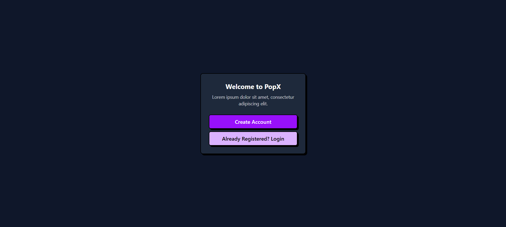

# Educase Task Management System

A comprehensive task management system designed for educational institutions to streamline assignment tracking, deadline management, and collaborative workflows.

 <!-- Replace with actual screenshot -->

## Table of Contents
- [Features](#features)
- [Installation](#installation)
- [Usage](#usage)
- [API Reference](#api-reference)
- [Contributing](#contributing)
- [License](#license)
- [Acknowledgements](#acknowledgements)
- [Contact](#contact)

## Features ✨

- **Task Creation**: Create and assign tasks with detailed descriptions  
- **Deadline Tracking**: Visual timeline for assignment deadlines  
- **Role-based Access**: Different permissions for students, teachers, and admins  
- **Notification System**: Email and in-app reminders  
- **Progress Monitoring**: Track task completion status  
- **Reporting**: Generate PDF reports for academic activities  
- **Collaboration Tools**: Comment threads and file sharing  

## Installation 🛠️

### Prerequisites
- Node.js v16+  
- npm v8+  
- MongoDB Atlas account  

### Setup Instructions

1. **Clone repository**
   ```bash
   git clone https://github.com/Mollygit001/Educase_task.git
   cd Educase_task
   ```

2. **Install dependencies**
   ```bash
   npm install
   ```

3. **Configure environment**
   ```bash
   cp .env.example .env
   ```

   Update `.env` with your credentials:
   ```
   MONGODB_URI=your_mongodb_connection_string
   JWT_SECRET=your_jwt_secret_key
   SMTP_HOST=your_email_service_host
   ```

4. **Run migrations**
   ```bash
   npm run db:seed
   ```

5. **Start development server**
   ```bash
   npm run dev
   ```

## Usage 🚀

### Web Interface  
Access the dashboard at [http://localhost:3000](http://localhost:3000)

### API Endpoints
```bash
# Create new task
curl -X POST -H "Content-Type: application/json" -d '{"title":"Math Homework", "dueDate":"2023-12-01"}' http://localhost:3000/api/tasks

# List all tasks
curl http://localhost:3000/api/tasks

# Update task status
curl -X PATCH -H "Content-Type: application/json" -d '{"status":"completed"}' http://localhost:3000/api/tasks/:taskId
```

## Contributing 🤝

We welcome contributions! Please follow these steps:

- Open an issue to discuss proposed changes  
- Fork the repository  
- Create your feature branch  
- Commit your changes  
- Push to the branch  
- Open a pull request  

```bash
# Development workflow
git checkout -b feature/amazing-feature
npm test  # Ensure all tests pass
git push origin feature/amazing-feature
```

## License 📄

This project is licensed under the MIT License - see the LICENSE file for details.

## Acknowledgements 🏆

- Icon set by Font Awesome  
- Authentication system inspired by Auth0  
- Task management concepts from Todoist  

## Contact 📧

For inquiries or support:

- GitHub: [@Mollygit001](https://github.com/Mollygit001)  
- Project Link: [Educase Task Management System](https://educase-henna.vercel.app/)

---

❤️ Open Source Love — PRs Welcome!
